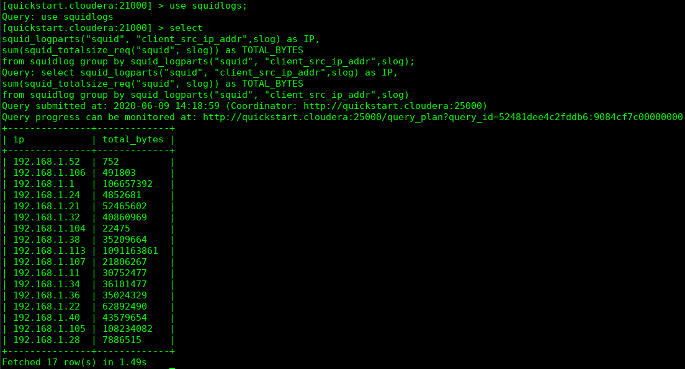

## liblogsquid

It's a library of utility functions to manipulate the registration line generated by the Squid-cache proxy. 
The main function *squid_logparts()*, allows us to retrieve only the information from the part of the log that interests us in a very simple way. 
The motivation to write these routines, in addition to the study and improvement of techniques, was due to the fact that this type of approach frees us from the SERDE routines in Java, usually written for data collection systems such as Apache Flume. 
So, very naturally, we can use these functions directly in SQL statements.

When we need new functions or have ideas about a new function, we will implement it in the project.

## Compilation and Installation

In Cloudera Quickstart environment: 
*Perform the steps below as root user *

* Compilation  
cd /user/cloudera 
mkdir liblogsquid 
cd liblogsquid 
git clone 
make 

* Copy to HDFS  
hdfs dfs -mkdir -p /user/cloudera/impala_udf 
hdfs dfs -put -f  lib/liblogsquid.so /user/cloudera/impala_udf 

* How to install library on Impala 
Instructions are available in the doc/impala-create-functions.sql file.

* Syntax 
_string squid_logparts(string,string,string);_ 
Arguments: 
1st: One these: squid | common | combined | referrer | useragent 
2nd: Reserved Words: see list doc/reserved-words.txt 
3rd: Log line 
Comments: The function will always return the values in the string type. If the value returned is a number you should use CAST(expression AS type) to do the conversion.  
_bigint squid_totalsize_req(string,string);_ 
1st: One these: squid | common | combined 
3rd: Log line 
Comments:This UDF is a facility that always returns the value of the 'Total Size of Reply send by client' field in bigint format

* Supported Squid Log Formats 
Up to this point the *squid_logparts()* can handle the default formats of Squid's log types, as follows:  
Log Format: squid 
%ts.%03tu %6tr %>a %Ss/%03>Hs %<st %rm %ru %[un %Sh/%<a %mt 
UDF Reserved Word: squid  
Log Format: common 
%>a %[ui %[un [%tl] "%rm %ru HTTP/%rv" %>Hs %<st %Ss:%Sh 
UDF Reserved Word: common  
Log Format: combined 
%>a %[ui %[un [%tl] "%rm %ru HTTP/%rv" %>Hs %<st "%{Referer}>h" "%{User-Agent}>h" %Ss:%Sh 
UDF Reserved Word: combined  
Log Format: referrer 
%ts.%03tu %>a %{Referer}>h %ru 
UDF Reserved Word: referrer  
Log Format: useragent 
%>a [%tl] "%{User-Agent}>h" 
UDF Reserved Word: useragent 

* Reserved words to retrieve parts of the log 
The complete list of words reserved for use in the function can be found in the *doc/reserved-words.txt* file

* Usage Examples 
select squid_logparts("squid", "unix_timestamp",
'1590128490.529   399 192.168.100.25 TAG_NONE/200 0 CONNECT 2.22.197.191:443 - ORIGINAL_DST/2.22.197.191 -'
); 
Returns: 1590128490.529 
select squid_logparts("combined", "client_src_ip_addr", FLD_LOG); 
Returns: 172.16.50.100  
slog = 1591165807.622      6 192.168.100.53 TCP_DENIED/403 **4131** POST http://su.ff.avast.com/R/A2QKIDVjOTFjZDExOTQ1MzQzZmViMTc3NzUzMDg4MTRiYzhlEgQEAgYgGKwCIgEAKgcIBBCjsex6OLCYjKABQiAAAAAAAAAAAAAAAAAAAAAA1rqmBFGB-l10EdXP6TiASUiAg5gI - HIER_NONE/- text/html 
select squid_totalsize_req("squid", slog) as tot
from squidlog; 
Returns: 4131

select 
  squid_logparts("squid", "client_src_ip_addr",slog) as IP, 
  sum(squid_totalsize_req("squid", slog)) as TOTAL_BYTES 
from squidlog 
  group by squid_logparts("squid", "client_src_ip_addr",slog); 

Results:   

